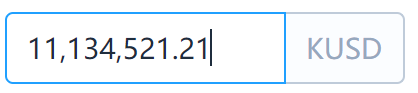

# element-ui-money
基于element ui 样式的货币格式输入框,自动补全分隔符

#### 属性：
fix 保留位数

max 最大值 - 输入过程限制最大值

min 最小值 - 失去焦点时候触发修正

fix 保留位数

clearable 清除输入

e.g [demo](https://aolose.github.io/money-io/)

```vue
<Money :max='1000' :min='100' :fixed='2' v-model="a" clearable>
  <template slot="append">USD</template>
</Money>
```



